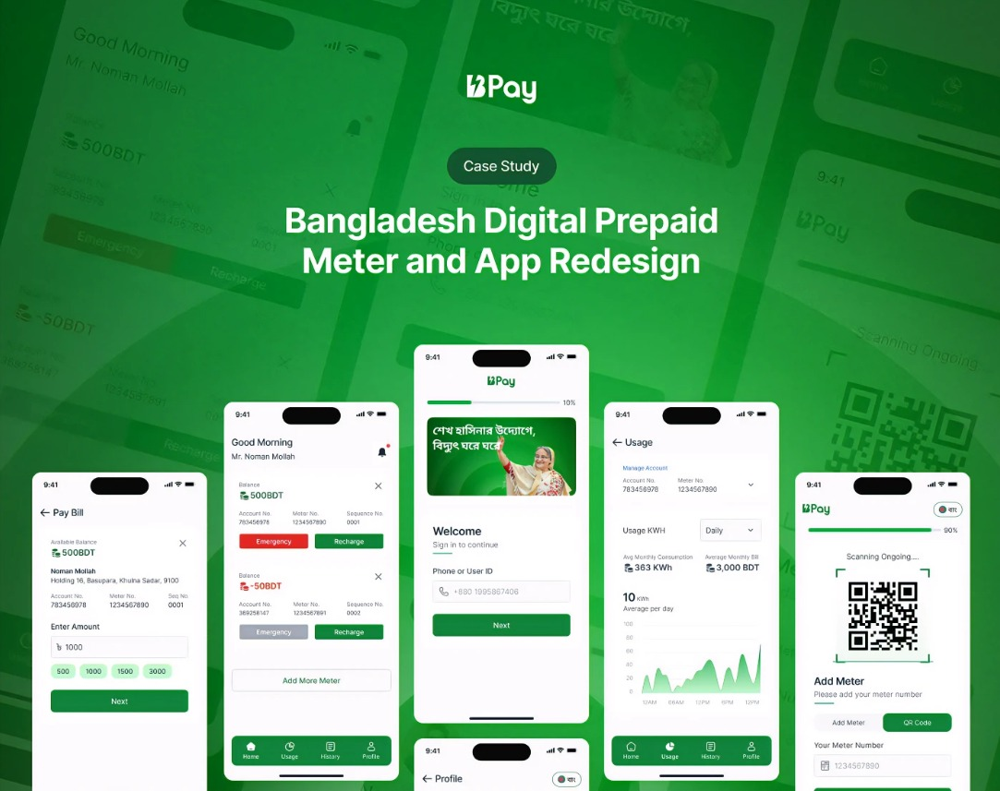
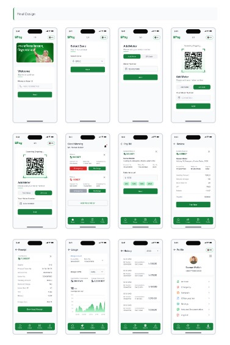

# b_pay

Bangladesh digital prepaid meter app ui design using Flutter

## 🔖 JOIN FLUTTER COURSE (BANGLA) 🔖

_Build real, responsive applications! Learn Basic Dart Programming & start build your own application.
This course is designed for beginner to intermediate developers who want to build their future with Flutter_

[Checkout Course Now](https://www.youtube.com/playlist?list=PLDitZ-MAvK-4Bt4wRTEidukT4OxRhRTBK)

**Support Me**

- Buy this project on Gumroad [here](https://www.buymeacoffee.com/alaminkarno)
- Support me via buy me a coffee. [here](https://www.buymeacoffee.com/alaminkarno)

**⚠️ Instruction**

- For the very first, run `flutter pub get` on your favorite IDE

**Packages we are using:**

- google_fonts
- font_awesome_flutter
- provider
- mobile_scanner
- badges
- syncfusion_flutter_charts

**UI Design Credit**

- Design with behance by [Multiple Owners](https://www.behance.net/gallery/167787463/Prepaid-Meter-App-Design-UX-Case-study)

**Code Credit**

- Code using Flutter with ❤️ by [Md. Al-Amin](https://github.com/alamin-karno)

## Animation (GIF):
| Parcel Tracker App (GIF)  |
|:-------------------------:|
|  |

## Screenshots:

### Repository Owner Info

### Md. Al-Amin
##### Junior Software Engineer (Android & iOS) at Rokomari.com

__Email :__ [alamin.karno@outlook.com](mailto:alamin.karno@outlook.com) \
__Github :__ [Md. Al-Amin](https://github.com/alamin-karno) \
__Facebook :__ [মোঃ আল-আমিন খন্দকার কর্ণ](https://facebook.com/alamin.kanro) \
__Linkedin :__ [Md. Al-Amin](https://www.linkedin.com/in/alaminkarno/)
